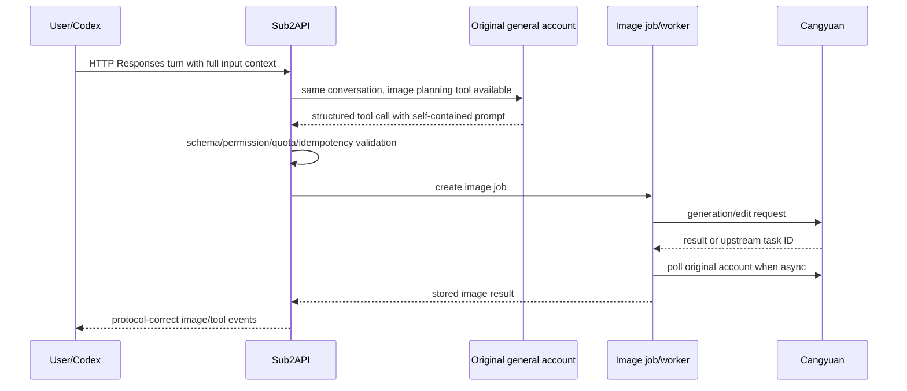

# 沧元专用生图集成开发指南

> 状态：Images API、持久任务、专用调度、用户工作台与 Codex HTTP/SSE/WebSocket 两阶段桥接代码已实现，默认关闭；真实沧元 generation、异步轮询、1K/2K/4K、JSON 基础 edit、multipart 重复 `image`、multipart mask 和 1K `b64_json` 已完成脱敏 POC。JSON-mask 直传实测返回 502，代码已改为在资产归一化后内部使用 multipart；本机 Codex CLI 0.116.0 的 HTTP/SSE 与 WebSocket 图片呈现已通过本地 fake-upstream 验证，Responses Lite 和完整断线/usage 语义仍未完成。日期：2026-08-06。

本文说明如何在 sub2api 的同一分组中安全混用普通账号与沧元专用生图账号，并为直接 Images API、Codex 自动生图和用户生图工作台提供统一执行基础。行为验收以 `openspec/changes/add-cangyuan-dedicated-image-routing/` 为准。

## 当前实现边界

- 已实现：`general/image_only` 强隔离、沧元 adapter、PostgreSQL 任务状态机、加密 PostgreSQL 临时 payload、对象存储、余额/订阅幂等结算、Images API、鉴权 content 代理和用户工作台。
- 默认关闭：`dedicated_image.enabled=false`、`worker_enabled=false`、`fallback_to_general=false`；升级不会自动改变现有流量。
- Codex 桥接默认关闭：除 `dedicated_image.enabled` 与 `worker_enabled` 外，还必须显式开启 `dedicated_image.codex_bridge_enabled`；HTTP `/responses`（含 SSE）与 Responses WebSocket 的协议桥接代码及本地 fake 回归已接入，WebSocket 整个会话走普通账号的 HTTP planner。真实本机 `codex-cli 0.116.0` 的 HTTP/SSE 与 WebSocket 非 JSON 交互模式已显示 `generated image`，证明核心客户端图片呈现链路；`--json` 只输出另一种事件投影。Responses Lite 不进入该桥接，完整断线/usage 语义仍待验收，因此正式开关继续保持关闭。
- Codex 规划阶段只选择 `general` 且具备 Responses 能力的账号；`image_only` 账号只由持久图片 Worker 调用。这样 HTTP 的 `previous_response_id` 与 WebSocket 的长上下文回放不会把对话交给沧元账号，也不会静默降级到只支持 Chat Completions 的账号。
- 真实上游状态：使用本地 key 在香港节点环境下完成了 `/v1/models`、1K/2K/4K generation、1K `b64_json`、1K 异步提交/轮询、JSON 基础 edit、multipart 重复 `image` 和 multipart mask 的脱敏 POC；JSON-mask 直传返回 502，因此带 mask 请求会自动内部转 multipart。本轮结论仅适用于香港节点环境，也未把任何 key、上游任务 ID 或签名 URL 写入文档。完整边界仍以 `docs/CANGYUAN_REAL_POC_RESULTS.md` 为准。
- 对象存储限制：任务只保存对象 key，读取使用当前对象存储配置。结果保留期内不得切换 endpoint/bucket；若必须切换，应先迁移旧对象或保持旧存储可读。

### 启用配置

```yaml
dedicated_image:
  enabled: true
  worker_enabled: true
  codex_bridge_enabled: false # 真实 POC 与回归通过后再改为 true
  fallback_to_general: false
  lease_duration_seconds: 60
  poll_interval_seconds: 2
  retry_delay_seconds: 10
  idle_delay_milliseconds: 500
  recovery_interval_seconds: 60
  sync_wait_timeout_seconds: 180
  payload_ttl_hours: 6
  max_submit_attempts: 3
  recovery_limit: 100
  result_prefix: images/cangyuan
  max_output_bytes: 67108864
```

还必须启用并完整配置现有 `image_storage`。建议首次上线保持 `fallback_to_general=false`，只给测试分组配置 `image_only` 账号。

## 1. 最终用户体验

管理员把沧元 API Key 作为一个现有 OpenAI API Key 账号加入目标组，账号用途选择“生图专用账号（沧元）”，配置 Base URL 和允许的 1K/2K/4K 模型。用户仍只持有自己的 Sub2API API Key。

- 普通聊天、写代码、工具调用：继续使用组内普通账号。
- 直接调用 Images API：优先使用组内沧元账号。
- Codex 明确要求生图：原普通账号先理解当前完整对话并整理图片计划，沧元只执行图片生成，结果回到同一 Codex 任务。
- 生图工作台：用户选择自己的 Sub2API API Key、模型档位和图片参数，提交后查看进度和下载结果。

这不是把用户对话“切给沧元”。文本会话和图片任务是两条关联但独立的链路。

## 2. 已有能力与需要补齐的部分

### 可复用

- `backend/internal/handler/openai_images.go`：Images API envelope 与入口。
- `backend/internal/service/openai_images.go`：现有图片转发、模型映射、计费和审核链路。
- `backend/internal/handler/image_task_handler.go`、`backend/internal/service/image_task.go`：现有异步 API 形态与对象存储思路。
- `backend/internal/service/image_generation_intent.go`：显式生图意图检测和被动 namespace 排除。
- `backend/internal/service/openai_account_scheduler.go`：优先级、并发和账号选择基础。
- `backend/internal/service/openai_codex_transform.go`：Codex native 图片工具注入基础。
- `backend/internal/service/openai_gateway_forward.go`、`backend/internal/handler/openai_gateway_handler.go`：HTTP/SSE/Responses WebSocket 转发。
- `buildOpenAIEndpointURL` 和 `GetOpenAIBaseURL()`：自定义 Base URL 及防重复 `/v1`。

### 必须新增或替换

- 账号用途强隔离。
- 沧元专用协议适配器和真实契约测试。
- Codex 工具截获、上下文规划和图片结果回填。
- PostgreSQL 持久图片任务与多实例 Worker。
- 工作台用户 API 和页面。

现有 `docs/ASYNC_IMAGE_TASKS.md` 描述的是已发布的 Redis/进程内异步实现。在本设计完成前它仍是当前行为文档；新实现上线时必须同步修订该文档，不能提前把计划写成既成事实。

## 3. 账号配置

管理员账号 CRUD 继续使用现有结构，只扩展：

```json
{
  "extra": {
    "account_purpose": "image_only"
  },
  "credentials": {
    "api_key": "<encrypted by existing account flow>",
    "base_url": "https://ai.cangyuansuanli.cn",
    "model_mapping": {
      "gpt-image-2-1k": "gpt-image-2-1k",
      "gpt-image-2-2k": "gpt-image-2-2k",
      "gpt-image-2-4k": "gpt-image-2-4k"
    }
  }
}
```

规则：

- `account_purpose` 只有 `general` 和 `image_only`。
- 缺失默认 `general`，因此数据库不需要为旧账号补写数据。
- `image_only` 第一版必须是 OpenAI API Key 账号；UI 明确标注沧元。
- Base URL 不应要求管理员手写 `/v1/images/...`。
- `model_mapping` 同时是公开模型映射和账号模型白名单。
- 不把“1K/2K/4K”做成账号类型；它们只是模型能力。

## 4. 路由算法

调度输入新增内部字段 `stage`：

```go
type RequestStage string

const (
    StageText           RequestStage = "text"
    StageImagePlanning  RequestStage = "image_planning"
    StageImageExecution RequestStage = "image_execution"
)
```

候选过滤伪代码：

```text
if stage in [text, image_planning]:
    candidates = accounts where purpose == general

if stage == image_execution:
    candidates = accounts where purpose == image_only
      and account belongs to resolved group
      and mapped model exists
      and account is enabled/healthy
      and concurrency is available

    if candidates empty and explicit fallback enabled:
        candidates = general accounts explicitly configured for the Cangyuan adapter
```

过滤之后继续用现有 priority、并发和调度算法。用途过滤必须发生在所有重试和候选重建之前，防止普通请求从旁路进入 image-only。

`fallback_to_general` 不是通用 OpenAI Images 回退。候选普通账号必须同时满足：OpenAI API Key 类型、HTTPS `base_url`、非空 `api_key`，并且 `model_mapping` 至少有一个目标是 `gpt-image-2-1k`、`gpt-image-2-2k` 或 `gpt-image-2-4k`。任务提交时仍会再次校验请求模型和映射；不兼容配置会终态失败，不会无限重试。

### 任务粘性

提交前的明确连接失败可以重新选另一个合格专用账号。只要请求可能已到上游，就不能自动重提；收到 `upstream_task_id` 后，任务永久绑定该 `account_id`，轮询只使用原账号。

## 5. Codex 长上下文编排

### 为什么不能直接切账号

沧元图片账号只有图片模型，无法处理 Responses 对话。它既不知道历史消息，也不能理解原文本上游保存的 `previous_response_id`。把最后一句“生成思维导图”直接发给沧元，只会得到缺少知识点的图片，甚至直接协议报错。

### 正确流程



当前桥接在 HTTP `/responses`（`stream=false` 或 SSE）和 Responses WebSocket 执行上述流程。WebSocket 普通文本回合仍由 `general` 账号处理；规划器会回放此前的用户/助手输入，图片回合再创建持久任务并由 `image_only` 沧元账号执行。Responses Lite 仍保持原逻辑。

文本模型通过内部 `sub2api_generate_image` 函数输出可验证结构，而不是只输出一段随意 prompt。当前 HTTP 桥接支持 `prompt`、`model`（1K/2K/4K）、可选 `size`、`aspect_ratio` 和 `quality`；服务端至少验证：

- `prompt` 不为空且已展开“上述/之前”的关键内容。
- resolution 与允许模型/尺寸一致。
- 数组、文本长度、语言和 layout 在允许范围。
- 不包含服务端凭据、隐藏系统提示或不必要的完整聊天转录。
- tool call ID 与客户端请求 ID 能形成稳定幂等键。

### 修改图片

用户说“把刚才那张改成蓝色”时，原文本账号仍负责理解“刚才那张”和修改要求。编排器取得上一任务的受控对象引用，将其作为 edit 参考图创建新任务。不要要求沧元根据文本会话记忆旧图。

## 6. 沧元协议映射

### 端点

```text
POST /v1/images/generations
POST /v1/images/edits
GET  /v1/images/generations/{task_id}
GET  /v1/images/edits/{task_id}
```

### 模型与尺寸

| 模型 | 最大像素 | 示例 |
| --- | ---: | --- |
| `gpt-image-2-1k` | 1,048,576 | 1024×1024 |
| `gpt-image-2-2k` | 4,194,304 | 2048×2048 |
| `gpt-image-2-4k` | 8,294,400 | 3840×2160 |

通用约束：总像素至少 655,360；宽高为 16 的倍数；最长边不超过 3840；比例不超过 3:1；`n=1`。`quality` 不改变档位。若请求传 `image_size`/`output_resolution`，必须与模型一致。

不要把“4K”直接改成 `4096x4096`。该尺寸同时超过最长边和 4K 档像素上限。

### 参考图与 mask

- JSON 参考图别名：`image`、`images`、`imageUrls`、`image_urls`、`reference_images`、`referenceImages`、`image_refs`。
- 去重后最多 9 张，每张不超过 10 MB。
- multipart edits 使用重复 `image` 字段。
- mask 仅一个，PNG/HTTPS，带 alpha，与第一张图同格式同尺寸，不超过 10 MB。

所有限制都应先在 sub2api 校验，以稳定错误并避免无效上游费用。

## 7. 持久任务设计

建议 PostgreSQL migration 创建 `image_generation_jobs`。完整字段见 OpenSpec；实现时重点保证：

- `idempotency_key` 在适当租户范围唯一。
- `upstream_task_id`、`account_id` 只对后端可见。
- 状态转换使用带当前状态条件的原子 UPDATE。
- Worker claim 使用数据库行锁或条件更新，claim 时递增 `claim_version`。
- 续租、写结果、失败和结算全部携带 claim version，过期 Worker 不能覆盖新 Worker。
- Redis 丢失不影响任务事实或新任务 payload：任务状态和加密临时 payload 均可从 PostgreSQL 恢复；定时扫描能唤醒 queued/submitted/polling 等状态。旧版本 Redis payload 在迁移窗口内只读兼容回退。
- 原始 prompt/图片只存在于请求内存或有 TTL 的加密载荷/临时对象。

### 推荐状态

```text
created
planning       # Codex only
queued
submitting
submitted
polling
storing
settling
completed
failed
submission_unknown
```

`submission_unknown` 需要运维可见，不能被普通重试器再次提交。若后续能从上游请求 ID 查询，可恢复到 submitted；否则在明确不存在任务后才允许人工重试。

## 8. 计费与幂等

推荐以内部 job ID 作为计费幂等键：

1. 创建任务时检查额度并一次性预占。
2. 重放同一幂等请求返回已有任务，不重复预占。
3. 上游明确失败时释放一次。
4. 成功转存后原子进入 settling，以实际模型/尺寸结算一次。
5. 结算暂时失败时只重试结算，不重新生成图片。

任务在创建时持久化 `billing_type`、`subscription_id`、基础价格、用户倍率和预计费用快照：

- 余额模式先把预计费用从可用余额转入冻结余额；成功时捕获，明确失败时释放。
- 订阅模式不冻结现金余额；成功时使用稳定 request ID 增加订阅用量。
- 两种模式都使用独立稳定 request ID 幂等更新 API Key 配额/限流用量、上游账号成本和 usage log。
- 结算已扣款但进程在写日志前崩溃时，Worker 重试会跳过重复扣款并补写幂等 usage log。

多图请求应拆成多条明确任务或父子任务，每张都可独立结算；UI 必须先告诉用户按张计费。

## 9. 对象存储和大图片内存

- 上游 URL 完成后立即受控下载，避免 URL 过期。
- 当前实现使用带 64 MiB 上限和超时的受控下载/解码，再校验 MIME 与尺寸后上传；4K 灰度时必须限制并发并观察进程 RSS。
- URL 与 Base64 路径都禁止无界读取；上传完成后不把图片字节写入 PostgreSQL 或普通日志。
- 数据库只存对象 key、MIME、宽高、字节数、Hash 等元数据。
- 对外使用短期签名 URL或鉴权 content 端点，不记录带 query 的完整 URL。
- 当前 content 读取使用“当前对象存储配置”；结果保留期内切换 endpoint/bucket 前必须迁移对象或保留旧存储读取能力。

## 10. 安全清单

- 上游凭据继续使用现有加密存储和日志脱敏。
- 参考图 URL 下载必须防 SSRF、DNS rebinding、危险重定向和超大/伪装内容。
- 图片解码必须限制尺寸、像素和 CPU，避免压缩炸弹。
- prompt、参考图、mask、base64、上游原始响应不能进入普通日志或 metrics label。
- 工作台不使用 localStorage/sessionStorage 持久化输入内容。
- 任务查询以当前用户和 API Key 所有权过滤；越权与不存在统一 404。
- 管理员测试图片明确会产生费用，并限制低并发、默认 1K。

## 11. 分阶段开发顺序

1. **POC**：沧元协议和真实 Codex 四种传输形态。
2. **账号用途**：只读兼容、CRUD 和调度隔离，开关关闭。
3. **适配器与持久任务**：先打通管理员测试和故障恢复。
4. **直接 Images API**：测试组灰度 1K，再 2K/4K。
5. **工作台**：复用持久任务，不另造执行链。
6. **Codex 编排**：仅在 POC 和协议回归通过后开启。
7. **扩大流量**：观察重复生成、重复计费、任务龄、4K 资源和普通流量回归。

## 12. 明确不应采用的实现

- 在用户文本中匹配“画图/图片/4K”后把整个请求换成沧元 Key。
- 让 `SupportsOpenAIImageCapability` 只按 API Key/OAuth 粗判并允许所有请求进入。
- 把上游 task ID 当作公开 task ID。
- 收不到提交响应就自动换账号再生一张。
- 使用单机 goroutine 和 Redis 作为唯一任务事实源；正确做法是由 PostgreSQL 保存任务事实和新 payload，Redis 只负责可选的缓存/唤醒。
- 把上游临时 URL 永久返回给用户。
- 为未来可能存在的供应商提前建设复杂 provider 类型和自定义协议 UI。
- 宣称图片模型能可靠绘制逐字准确的复杂中文知识图。

## 13. 相关文档

- [详细 API 契约](./CANGYUAN_DEDICATED_IMAGE_API.md)
- [当前异步图片任务文档](./ASYNC_IMAGE_TASKS.md)
- [OpenSpec 变更索引](../openspec/changes/add-cangyuan-dedicated-image-routing/README.md)
- [图片请求分层并发控制](./IMAGE_CONCURRENCY.md)
- [运行与回滚手册](./CANGYUAN_IMAGE_OPERATIONS.md)
- [生图运维指标](./CANGYUAN_IMAGE_OBSERVABILITY.md)
