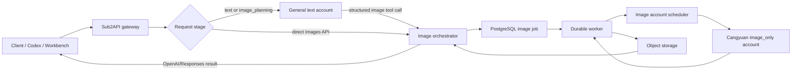
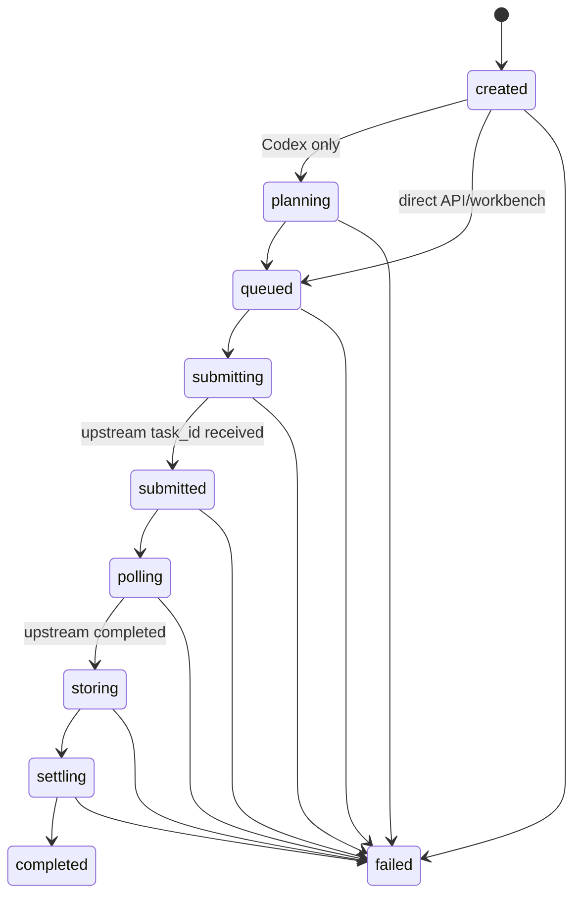

# Design

## Context

sub2api 已有同步/异步 Images API、图片权限与计费、模型映射、账号调度、Redis 图片任务、对象存储、Codex 图片意图检测和 Responses 工具注入。当前缺口是：

- 账号没有“仅可生图”的强隔离属性。
- Codex native 图片工具仍由可处理 Responses 的普通文本上游执行，无法把执行阶段定向到沧元。
- 现有异步图片任务以 Redis 和进程内 goroutine 为主，服务重启会丢执行者，不适合作为生产级上游异步轮询器。
- 没有面向用户的生图工作台。

## Goals / Non-Goals

### Goals

- 同一分组容纳普通与沧元生图账号，并按能力安全切换。
- 不改变普通聊天、代码、工具和现有 Images 请求的兼容行为。
- 长上下文图片请求保留原文本模型理解能力和会话粘性。
- 2K/4K 档位明确映射到沧元模型，而不是依赖 `quality` 猜测。
- 任务可跨重启、多实例恢复，且不重复生成、不重复扣费。
- 对调用方隐藏上游身份、凭据、task ID 和短期 URL。

### Non-Goals

见 `proposal.md`。尤其不在第一版抽象任意专用生图供应商，不承诺文字型知识图的排版准确率。

## Architecture



## Decision 1: 账号用途只有两种

在 `accounts.extra` 中保存：

```json
{"account_purpose":"general"}
```

或：

```json
{"account_purpose":"image_only"}
```

读取规则：

- 字段缺失、空值或旧数据一律归一为 `general`。
- API 只接受 `general`、`image_only`；未知值返回 400，不静默接受。
- 不新增数据库认证类型；`image_only` 第一版必须是 OpenAI API Key 账号。
- `image_only` 继续复用 `credentials.api_key`、`credentials.base_url`、`credentials.model_mapping`、`group_ids`、`priority`、`concurrency` 和状态字段。
- 管理 UI 文案为“普通账号”和“生图专用账号（沧元）”。

示例映射：

```json
{
  "base_url": "https://ai.cangyuansuanli.cn",
  "model_mapping": {
    "gpt-image-2-1k": "gpt-image-2-1k",
    "gpt-image-2-2k": "gpt-image-2-2k",
    "gpt-image-2-4k": "gpt-image-2-4k"
  }
}
```

## Decision 2: 路由按阶段和能力，不按关键词切账号

内部请求阶段：

```text
text
image_planning
image_execution
```

过滤规则：

| 阶段 | 可选账号 | 说明 |
| --- | --- | --- |
| `text` | `general` | 聊天、写代码、工具、Responses 等全部普通流量 |
| `image_planning` | 原 `general` | 理解完整上下文并产生图片计划 |
| `image_execution` | 优先 `image_only` | 仅向沧元发送自包含图片参数 |

`image_only` 账号只有同时满足以下条件才可选：启用、属于目标组、并发可用、模型映射允许、用途正确、请求通过参数校验。获得沧元 `task_id` 后，后续查询必须固定到原账号；不得因轮询失败换账号并重新提交。

配置建议：

```yaml
dedicated_image:
  enabled: false
  worker_enabled: false
  codex_bridge_enabled: false
  fallback_to_general: false
```

两个开关默认关闭。灰度时先只对测试组开启；无专用账号默认返回 `image_provider_unavailable`。管理员显式启用 fallback 后，才允许执行阶段回退到现有普通图片账号。普通流量在任何配置下都不得回退到 `image_only`。

## Decision 3: Codex 使用两阶段编排

当用户说“把我们之前讨论的知识点生成一张思维导图”时：

1. 当前本地桥接处理官方 Codex HTTP `/responses`（含 SSE）与 Responses WebSocket；Responses Lite 不进入桥接。HTTP 的 `previous_response_id` 仍绑定 `general` planner，WebSocket 通过 HTTP planner 和回放输入维持跨回合上下文。
2. 网关向官方 Codex 的 Responses 规划请求注入内部 `sub2api_generate_image` 函数；不要求客户端预先声明原生 `image_generation` 工具，因为真实 Codex CLI 可能省略该声明。这样 general 文本账号可以判断当前轮次是否真的执行生图。仅讨论图片、讨论 API、出现 `image_gen` namespace 或要求修改代码，不应调用该函数。
3. 文本模型产生自包含的 `prompt`，并可选择 `model`（1K/2K/4K）、`size` 和 `quality`。
4. 网关验证计划参数，创建独立图片任务并调用沧元 image_only 账号。
5. 完成结果转存对象存储，再合成 HTTP JSON 或 SSE Responses `image_generation_call`。
6. 图片任务账号粘性与文本账号/会话粘性相互独立；规划阶段只选具备 Responses 能力的 `general` 账号，执行阶段只选 `image_only`。Responses Lite 仍在真实 POC 通过前保持关闭。

当前内部工具参数：

```json
{
  "prompt": "完整、自包含、可直接交给图片模型的提示词",
  "model": "gpt-image-2-4k",
  "size": "3840x2160",
  "quality": "high"
}
```

`prompt` 是沧元必需输入；服务端不得只把用户最后一句话发送给沧元。完整上下文只发送给 general 规划账号，沧元只接收自包含图片参数。

工具调用的可靠性约束：

- 同一 planner 响应在非流式、SSE 或 WebSocket 回放中可能重复出现同一个
  `function_call` 快照或参数增量。网关按 `call_id` 和规范化后的参数做去重；
  完全相同的重复调用只创建一个图片任务。
- 同一响应出现两个不同的图片调用，或同一个调用出现不同参数，返回稳定的
  `image_plan_invalid`，不得猜测用户想生成哪一张，也不得把 `n>1` 偷换成一次
  上游调用。
- planner 在图片工具调用前已经产生的用户可见短文本要保留在合成 Responses
  输出中，并排在 `image_generation_call` 之前；这段文本只能回填给客户端，不能
  拼进沧元 prompt，避免把未验证的上下文再次发送给 image-only 账号。
- 客户端断线、取消等待或桥接超时只结束当前响应等待，不撤销已创建的持久图片
  任务。重连时复用同一个 `call_id`/幂等键；已接受的上游任务继续固定原账号
  轮询，不能因为客户端重试而重新生图或重复结算。

### Codex POC 门槛

正式启用或灰度前必须用真实 Codex 客户端抓取并固定：HTTP、SSE、Responses WebSocket、Responses Lite 下的请求体，工具声明，实际 tool/function call，图片输出事件，错误事件，断线续传以及被动 namespace 行为。POC 必须证明：

- 工具调用可被网关可靠截获，不会同时由文本上游执行图片。
- 合成事件能被当前 Codex 客户端显示为图片，而不是未知 tool output。
- 文本流在工具调用前后的顺序、终止原因和 usage 可正确表达。
- WebSocket 每轮的关联 ID、取消和重连语义明确。

任一主客户端形态不能闭环时，第一阶段只发布直接 Images API 和工作台，Codex 自动编排保持关闭。

## Decision 4: 沧元专用适配器

基础端点：

```text
POST /v1/images/generations
POST /v1/images/edits
GET  /v1/images/generations/{task_id}
GET  /v1/images/edits/{task_id}
```

模型名决定档位：`gpt-image-2-1k`、`gpt-image-2-2k`、`gpt-image-2-4k`。`quality` 不能切换档位。模型解析顺序为：明确请求模型 → 公共模型映射 → 分辨率档位；无法唯一确定时返回 400，不猜测。

尺寸校验：宽高为 16 的倍数、最长边不超过 3840、长宽比不超过 3:1、总像素不少于 655360；1K/2K/4K 上限分别为 1048576、4194304、8294400 像素。4K 常用 16:9 是 `3840x2160`，不是 4096 边长。传入 `image_size` 或 `output_resolution` 时必须与模型档位一致。

tier 模型 `n` 只能为 1。多图由 Sub2API 拆成多个独立任务，并明确按张计费，不向单次沧元请求传 `n>1`。

参考图最多 9 张去重后的图片，单图不超过 10 MB；支持 JSON 别名和 multipart 重复 `image`。远程 URL 仅允许 HTTPS，并经受控下载器做 DNS/IP、重定向、MIME、大小、超时和解压炸弹检查。mask 仅允许单个 PNG/HTTPS，必须带 alpha、与第一张输入图同格式同尺寸且不超过 10 MB。

同步上游返回的 `url` 或 `b64_json` 均归一化；异步完成 URL 必须立即下载并转存，避免过期。

## Decision 5: PostgreSQL 任务是事实源

新增 `image_generation_jobs`，建议字段：

```text
id, user_id, api_key_id, group_id, account_id
source(api|codex|workbench), operation(generation|edit)
status, public_model, upstream_model, requested_size, actual_size
quality, response_format, upstream_task_id(private)
idempotency_key(unique), prompt_hash, payload_object_ref/private_payload_ref
result_object_refs, estimated_cost, held_cost, settled_cost
error_code, error_message(redacted), attempt_count
claim_version, lease_expires_at, next_attempt_at
created_at, submitted_at, completed_at, updated_at
```

状态机：



多实例 Worker 使用数据库原子 claim、递增 `claim_version`、租约续期和 fencing 更新。Redis 仅做队列唤醒、短期锁/限流；加密临时 payload 写入 PostgreSQL 的独立临时表，Redis 丢失后任务状态、payload 和轮询都能从 PostgreSQL 恢复。升级窗口内读取旧 Redis payload 只作为兼容回退。

敏感 prompt/参考图片不得直接进入普通日志。若任务需要跨进程保存原始参数，写入加密临时 payload 表或受控临时对象并设置 TTL；普通任务表只存引用和 Hash。

## Decision 6: 幂等、失败切换与结算

- 幂等键优先取 Codex tool call ID 或客户端 `Idempotency-Key`，否则由 `user + api_key + request_id + operation` 生成。
- 同一幂等键重复提交返回已有任务，不创建第二次上游生成。
- `submitting` 阶段如网络在“上游可能已接受”后断开，默认标记 `submission_unknown` 并人工/定时核查；不得自动换账号重提。
- 只有明确未发出请求的连接前失败，才可在未产生 `upstream_task_id` 时换另一个 image-only 账号。
- 获得 `upstream_task_id` 后必须固定 `account_id` 查询。
- 预占只发生一次；失败/取消释放；成功以数据库原子状态转换结算一次。结算幂等键为内部 job ID。
- 客户端取消等待不等于取消已提交的上游生成；任务继续完成并可查询，避免已付费结果丢失。

Codex 图片响应使用可识别的 `resp_img_...` 合成 ID。该 ID 同时写入 replay store 和 Responses 账号粘性 store，绑定原本负责规划的 general 账号；后续普通文本轮次即使不再携带被动图片 namespace，也必须先命中该桥接路由，再将合成 ID 换回原上游 `previous_response_id`。

## Decision 7: API 边界

兼容网关继续提供：

```text
POST /v1/images/generations
POST /v1/images/edits
POST /v1/images/generations/async
POST /v1/images/edits/async
GET  /v1/images/tasks/{task_id}
```

并保持现有无 `/v1` 别名。公开 task ID 使用 Sub2API ID，绝不返回沧元 task ID。

工作台使用 JWT 用户 API：

```text
POST /api/v1/user/image-workbench/jobs
GET  /api/v1/user/image-workbench/jobs
GET  /api/v1/user/image-workbench/jobs/{id}
GET  /api/v1/user/image-workbench/jobs/{id}/content
```

工作台请求选择用户自己的 `api_key_id`。服务端验证该 Key 属于当前用户、启用且有权访问目标组；前端和 API 均不得接收上游 API Key。

管理员继续复用账号 CRUD。可新增付费测试端点 `POST /api/v1/admin/accounts/{id}/test-image`，必须二次提示费用，默认 1K，结果转存且不回显密钥。

## Decision 8: 响应、错误与隐私

对外错误使用稳定代码，主要包括：

```text
image_provider_unavailable
image_model_not_allowed
image_invalid_size
image_invalid_reference
image_invalid_mask
image_submission_unknown
image_upstream_rejected
image_upstream_timeout
image_storage_failed
image_task_not_found
image_orchestration_unavailable
image_plan_invalid
```

日志允许：内部 job ID、请求 ID、用户/API Key/group ID、用途、模型、尺寸、状态、耗时、脱敏错误码。日志禁止：Authorization、上游 Key、完整 prompt、参考图内容、base64、签名 URL query、沧元原始响应正文。

工作台/API 通过同一用户与 API Key 所有权做 404 隐藏；对象存储使用短期签名 URL 或受鉴权 content 代理。内容响应使用 `Cache-Control: private, no-store`，下载文件名与 MIME 需安全归一化。

## Decision 9: 兼容与发布

- 功能默认关闭；旧账号自动视为 `general`。
- 先上线 schema 和只读用途字段，再上线直接 Images/工作台，最后在 POC 通过后上线 Codex 编排。
- 使用测试组和少量 image-only 账号灰度；普通请求建立黄金请求回归集。
- 回滚先关闭路由与工作台入口，Worker 停止领取新任务但继续轮询已提交任务；不得因回滚遗弃已收费任务。

## Known Limitations

- 图片模型对大量中文小字、严谨关系和精确拼写不稳定。`mind_map` 计划只能提升语义完整性，不等同于可验证图表渲染。
- 4K 输出可能显著增加内存、网络、对象存储和响应时间。实现必须流式下载/上传并设置并发和大小上限。
- 沧元文档与真实行为可能漂移；以适配器契约测试和 POC 记录为上线依据。
